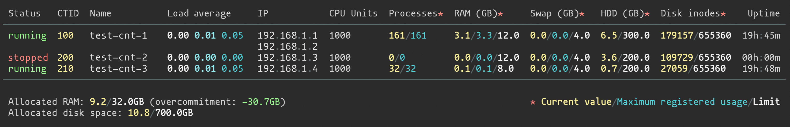

# vzlistim
### Improved `vzlist` command line utility

The `vzlistim` utility is used to list the containers existing on the given hardware node with improved display and live reload capability, compared to `vzlist` utility.

Available columns:
* Status
* CTID
* Name
* Load Average
* IP
* CPU Units
* Processes (current value/maximum registered usage)
* RAM (current value/maximum registered usage/limit)
* Swap (current value/maximum registered usage/limit)
* HDD (current value/limit)
* Disk inodes
* Uptime

## Requirements
* node >= v10
* vzlist

## Install
`npm i -g vzlistim`

## Usage
`vzlistim [-l] [-v]`

Here follows the description of available options:

| Option | Description |
|--------|-------------|
| -l, --live | constantly update table with new data until Ctrl+C |
| -v, --version | display utility version |
